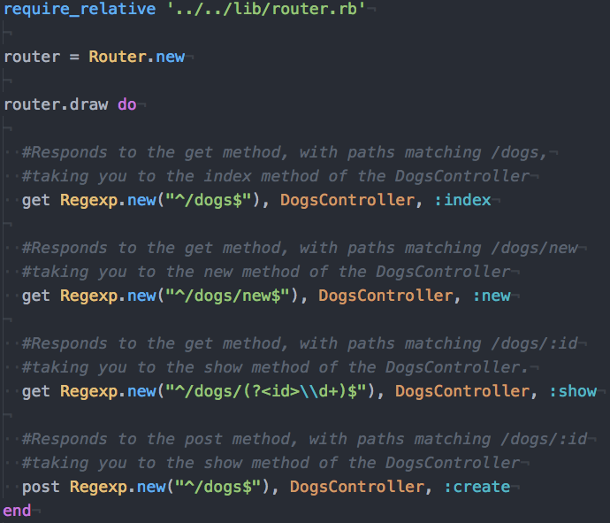

# README

## Overview
Ruby Maverick(MVC) is a light-weight MVC built in ruby, inspired by Ruby on Rails. This API is currently in production.

## Documentation
### Routes
Ruby Maverick(MVC) routes receive an HTTP request and find the appropriate controller. Maverick(MVC) currently supports GET, POST, PUT, DELETE, and PATCH requests.

- Create a new Router Object. This object will be in charge of handling your routes.
- Draw your routes with the HTTP method, regex object that will match the path,  controller to send the request to, and the appropriate method within the controller

### Controllers
Maverick(MVC) controllers are in charge of handling an appropriate HTTP request. All controllers must inherit from ControllerBase; as this will provide each controller with useful methods.

- Create a Controller Class that inherits from ControllerBase
- Create your appropriate controller methods (make sure you have appropriate routes for them!)

#### #render(template_name)
- Sends back a response, rendering the appropriate template found in the file tree at: `./views/#controller_name/template_name.html.erb`
- NB: If you don't call render in your controller method, it will automatically render `./views/#controller_name/method_name.html.erb`

#### #redirect_to(url)
- Redirects the requester to the url.

#### #session[key], #session[key]=
- Ability to access and set the cookies of our user. Key may be a string or a symbol. Session objects are hash-like.

#### #flash[key], #flash[key]=
- Sets/access a cookie that will persist for ONE response cycle. Flash objects are hash-like.

#### #flash.now[key], #flash.now[key]
-  Sets a key value pair, that can be access during this response cycle.

#### ::protect_from_forgery
- Protects website from CSRF attacks, using requiring an authenticity token in the form and a user's cookie. HIGHLY SUGGESTED

#### #form_authenticity_token
- Generates a form authenticity token. You must use these in your form if you are using ::protect_from_forgery
