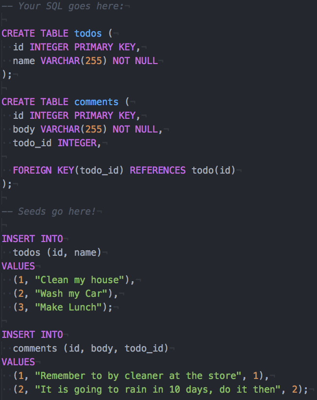
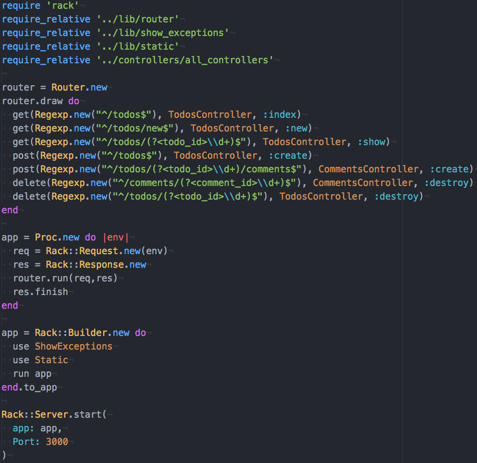
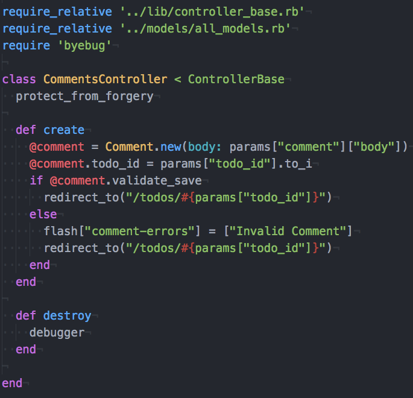
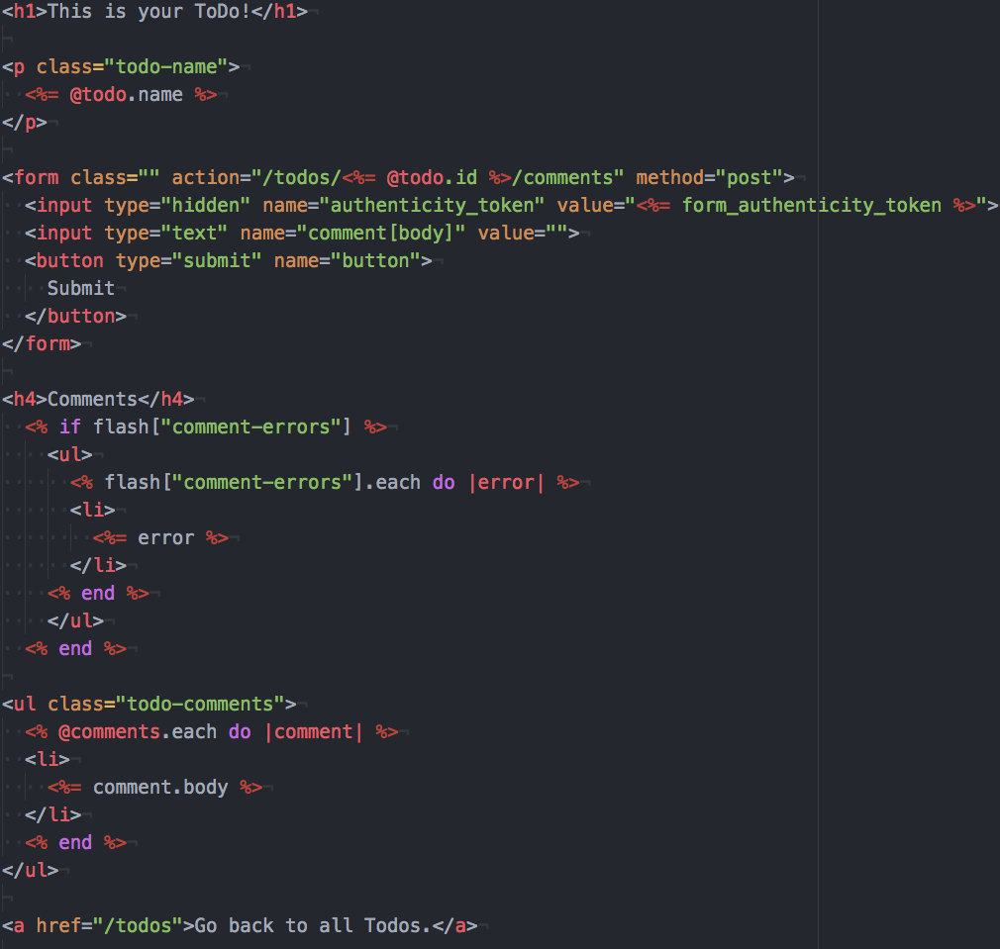

# README

## Overview
Ruby Maverick(MVC) is a light-weight MVC built in ruby, inspired by Ruby on Rails. This API is currently in production.

## Documentation

### File Structure
- Routes and App are created in `/app`
- HTML/ERB Files are created in `/views/controller_name/action_name.html.erb`
- Model Classes are created in  `/models/model_name`
- Controllers are created in `/controllers/controller_name`
- Database initializations are created in `/lib/interACT/database.sql` and `/database.db`

### Database Connection

#### Creating Your Database
Using the DBConnection class, you can easily create a new database.

- In `lib/interACT` create a new file `create_my_database.sql`, wherein you write SQL for your database.

- In `lib/interACT/db_connection.rb` modify the constants and the appropriate filenames with your new files `create_my_database.sql` and  `create_my_database.db`

- ONLY use the `DBConnection::reset` method, if you want to reset your database.

ex.

#### Adding New Tables
You can call DBConnection.execute("SQL COMMANDS HERE") from the ruby console to add new columns to your database. Do NOT edit your create_my_database.sql, as this code will only be run once.

### interACT Models
Using instances of our database rows, interACT joins our controllers and our database.

#### Creating a Model
- Make sure you have an appropriate table in your database before you create a model.
- Make a new class, that inherits from the SQLObject class.
- Make sure to call finalize!, in order to define getter/setter methods for the column names!

ex.

#### ::finalize!
- Defines the getter/setter methods for each column name
- eg. If a cat has an age, owner_id, and color column, we can both change and access those column_names through our instance.

#### ::columns
- Returns array of column names

#### ::table_name, ::table_name=(name)
- By default the table name will be snake case, pluralized of the model class name. eg. `class CuteCat`'s table name will be cute_cats'
- If you want to alter your table name, you can use the `table_name=(name)` method.

#### ::belongs_to(name, options)
- Used to create many to one associations. eg.`class Dogs < SQLObject belongs_to :owner` creates the method #owner for the dog class.

- By default the foreign_key will be name_id. eg. `:owner_id`, the primary_key will be `:id` and the Class Name will be `name.camelcase`, eg. `Owner`

- If you want to customize these you can pass in an options hash of the form:
`belongs_to :owner, foreign_key: :person_id, primary_key: :id, class_name: :Person`
to overwrite these defaults

#### ::has_many(name, options)
- Used to create one to many associations. eg. `class Owner < SQLObject has_many :dogs` creates the method #dogs for the dog class

- Defaults follow the same conventions as outlined above(#belongs_to).

#### ::has_one_through(name, through_name, source_name)
- Used to create one to many associations when the tables do not join directly. eg. Pet belongs to an owner, Owner belongs to a country, therefore Pet belongs to a country. `class Pet <SQLObject has_one_through :country, :owner, :country`

#### ::all
- Returns all rows in the appropriate table as an array of SQLObjects.

#### ::find(id_num)
- Returns the first instance as a SQLObject.

#### #attributes
- Returns a hash of all the attributes associated with that instance.

#### #attribute_values
- Returns an array of each column name associated with that instance.

#### #save
- Persists changes of the model instance to the database.

#### #where(params)
- Returns an array of SQLObjects, that match the given conditions.
- eg. Cat.where(age: 2); returns all cats whose age is 2.

### Routes
Ruby Maverick(MVC) routes receive an HTTP request and find the appropriate controller. Maverick(MVC) currently supports GET, POST, PUT, DELETE, and PATCH requests.

- Create a new Router Object. This object will be in charge of handling your routes.
- Draw your routes with the HTTP method, regex object that will match the path,  controller to send the request to, and the appropriate method within the controller

### Controllers
Maverick(MVC) controllers are in charge of handling an appropriate HTTP request. All controllers must inherit from ControllerBase; as this will provide each controller with useful methods.

- Create a Controller Class that inherits from ControllerBase
- Create your appropriate controller methods (make sure you have appropriate routes for them!)

ex.

#### ::protect_from_forgery
- Protects website from CSRF attacks, using requiring an authenticity token in the form and a user's cookie. HIGHLY SUGGESTED

#### #form_authenticity_token
- Generates a form authenticity token. You must use these in your form if you are using ::protect_from_forgery

#### #render(template_name)
- Sends back a response, rendering the appropriate template found in the file tree at: `./views/#controller_name/template_name.html.erb`
- NB: If you don't call render in your controller method, it will automatically render `./views/#controller_name/method_name.html.erb`

#### #redirect_to(url)
- Redirects the requester to the url.

#### #params
- Access to parameters of the request, including the URL wildcards and the body of the request.

#### #session[key], #session[key]=
- Ability to access and set the cookies of our user. Key may be a string or a symbol. Session objects are hash-like.

#### #flash[key], #flash[key]=
- Sets/access a cookie that will persist for ONE response cycle. Flash objects are hash-like.

#### #flash.now[key], #flash.now[key]
-  Sets a key value pair, that can be access during this response cycle.

### Views
- Views must be in the file tree as follows: `./views/#controller_name/template_name.html.erb`. This will allow your controller to find the appropriate view.
- Views can support html, and ruby embedded in erb tags.

ex.

### Static Assets
- Static assets(eg. .txt, .jpg, .zip, .pdf, etc., )for use in your view must be in the file tree as follows: `./public/file_name.extension`
- Files can be accessed './'
